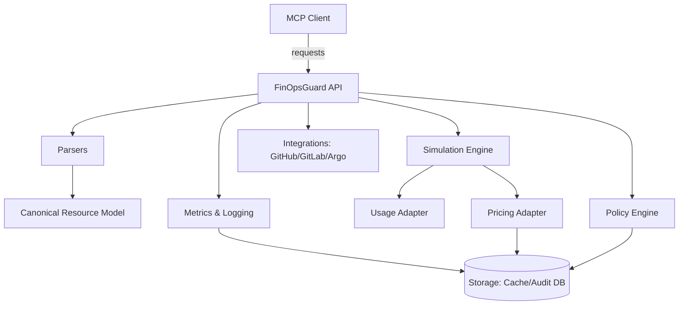

# Architecture

```mermaid
flowchart TD
    A[MCP Client] -->|requests| B[FinOpsGuard API]
    B --> C[Parsers]
    C --> D[Canonical Resource Model]
    B --> E[Simulation Engine]
    E --> F[Pricing Adapter]
    E --> G[Usage Adapter]
    B --> H[Policy Engine]
    B --> I[Integrations: GitHub/GitLab/Argo]
    B --> J[Metrics & Logging]
    J --> K[(Storage: Cache/Audit DB)]
    F --> K
    H --> K
```

- See `fin_ops_guard_mcp_agent_requirements_document.md` for details.
